# Collector 软件使用说明书

**版本号：1.1.0**

[TOC]

---

## 1. 概述

Collector 是一款面向测试人员的**数据采集卡（后续简称为模块）配置工具**，支持温度、电压、电流、频率采集卡配置。

软件提供图形化操作界面，简化模块配置，支持自动创建模块、自动绑定模块，并可导出标准 DBC 文件，便于后续在CAN 工具中进行数据解析和分析。

---

## 2. 界面说明

### 2.1 CAN 设备管理界面

软件启动后将自动弹出【CAN设备管理】界面。
确保物理连接正确，设备上电后可开启 CAN 通道。

<div style="text-align: center;">
    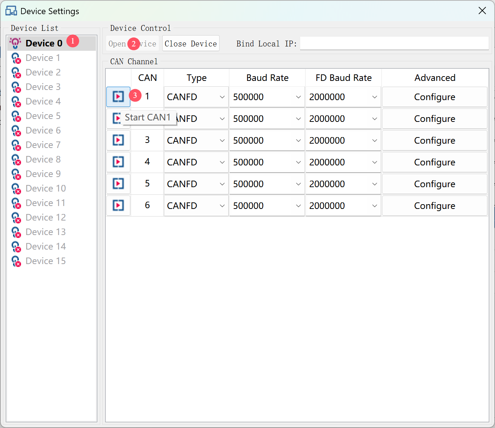
</div>

- **左侧**：设备列表，鼠标悬停显示设备和 CAN 通道状态。

<div style="text-align: center;">
    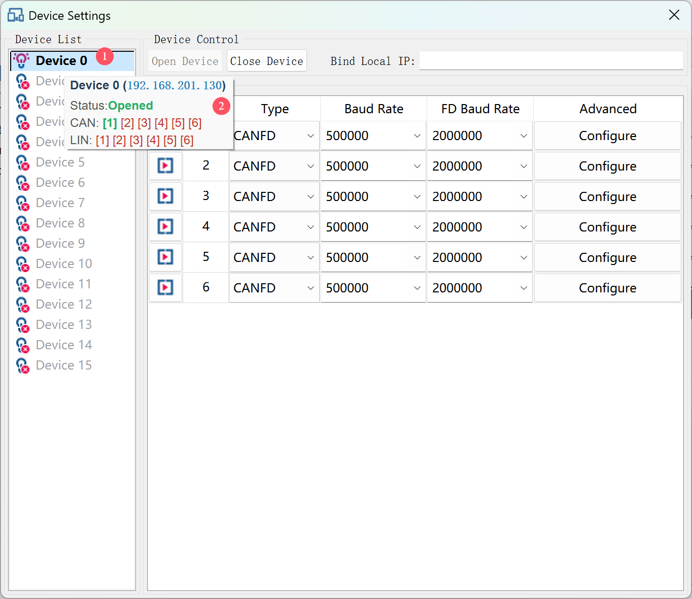
</div>

- **右侧**：
  - **上部**：包含“打开设备”（Open Device）和“关闭设备”（Close Device）按钮，以及绑定本地 IP 输入框（用于多网卡场景）。
  
  - **下部**：CAN 通道表格，包含“打开通道”（Start CANx）和“关闭通道”（Stop CANx）按钮。可设置CAN设备初始化参数，点击“高级选项”配置采样率和终端继电器。

<div style="text-align: center;">
    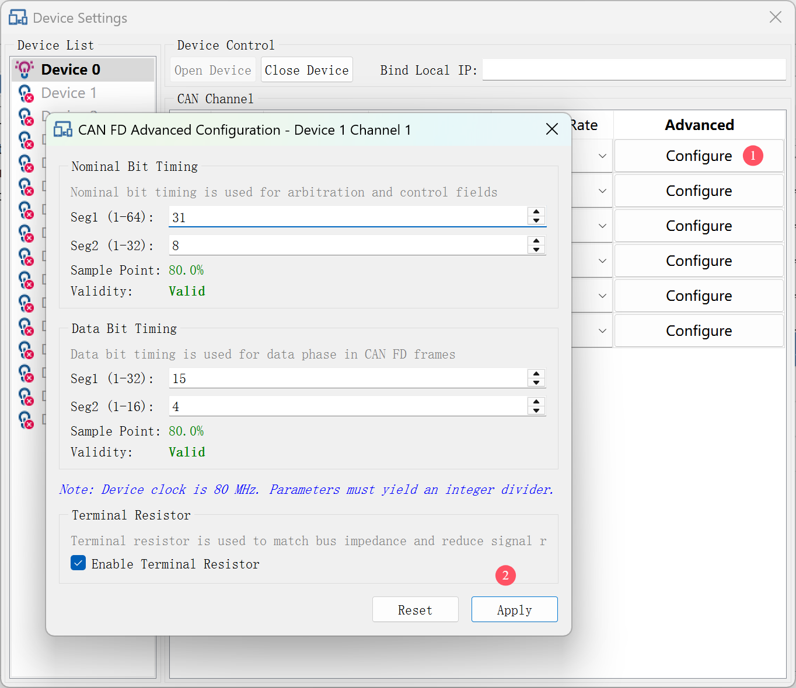
</div>
**注意：确保波特率与对端设备匹配，否则会报错。**

---

### 2.2 模块预配置界面

关闭【CAN设备管理】界面后，将自动弹出【模块预配置】界面，可根据实际需求进行自定义参数配置。

<div style="text-align: center;">
    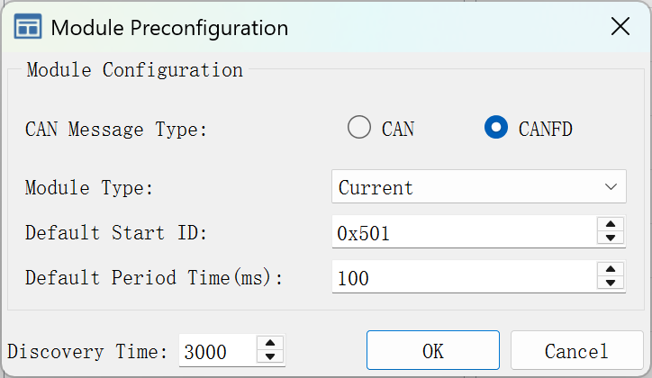
</div>


- 模块输出报文类型（CAN / CANFD）

  选择采集模块输出的CAN报文类型。

  🟢 **举例说明：**

  假设当前配置的是温度模块，温度模块有 **16个通道**，每个通道输出 **4 字节**（共 64 字节）数据：

  | 报文类型  | 发送帧数                      | 优点             | 缺点          |
  | --------- | ----------------------------- | ---------------- | ------------- |
  | **CAN**   | 需要发送 8帧（每帧 8 字节）   | 兼容性强         | 帧多、占带宽  |
  | **CANFD** | 只需发送 1 帧（每帧 64 字节） | 效率高、节省带宽 | 需 CANFD 支持 |

  🛠️ **建议**：如无特殊需求，推荐选择 **CAN FD** 模式。

- 模块类型

  选择自定义配置的模块类型，支持温度、电压、电流、频率四种类型的模块配置。

- 模块输出报文默认起始ID

  指模块每次发送 CAN 报文时的 **起始帧 ID（十六进制）**。
  
  🟢 **举例说明（CAN 类型）：**
  
  当前温度模块配置为 **CAN 类型、16 通道**、每通道 4 字节，共需 **8 帧报文**：
  
  - 起始 ID 设为0x101，则：
    - 第1帧 ID：`0x101`
    - 第2帧 ID：`0x102`
    - 第3帧 ID：`0x103`
    - 第4帧 ID：`0x104`
    - 第5帧 ID：`0x105`
    - 第6帧 ID：`0x106`
    - 第7帧 ID：`0x107`
    - 第8帧 ID：`0x108`
  
  🟢 **举例说明（CANFD 类型）：**
  
  - 起始 ID 设为0x101，则：：只产生一帧报文 ID：`0x101`
  
  ⚠️ **注意事项**：所有模块输出报文 ID 不能重复
  
- 模块默认采集周期（单位：ms）

  指模块**多长时间采集一次**数据并发送 CAN 报文。

  🟢 **举例说明：**

  设置为 `100` 表示：

  - 每 **100ms 采集一次**数据
  - 即 **每秒 10 次**（1000ms / 100ms = 10Hz）

  如果设置为 `500`，则采集频率为 2Hz（每秒两次）

  🛠️ **建议设置范围**：

  | 频率（Hz） | 周期（ms） | 说明               |
  | ---------- | ---------- | ------------------ |
  | 10 Hz      | 100 ms     | 实时性较强（推荐） |
  | 2 Hz       | 500 ms     | 常用于慢变信号     |
  | 1 Hz       | 1000 ms    | 最低频率           |

  ⚠️ 采集频率越高，CAN 带宽越大，需结合报文类型合理设置。

- 模块设备发现时间（单位：ms）

  用于**模块发现**阶段，控制广播命令发出后的**等待时长**，时间越长，发现模块成功率越高，但搜索越慢

  ⚠️ 超时设置太高会拖慢启动流程；设置太低可能导致漏发现模块。


---

### 2.3 主界面

关闭【模块预配置】界面后，将进入主界面。如下图所示：

<div style="text-align: center;">
    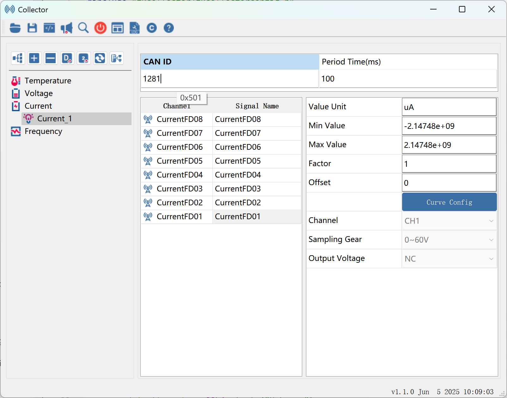
</div>

整个主界面从上到下、从左到右，主要划分为以下 4 个区域：

---

### 2.3.1 工具栏（顶部）

如下图所示，工具栏共包含 10 个功能按钮，对应功能说明如下：

<div style="text-align: center;">
  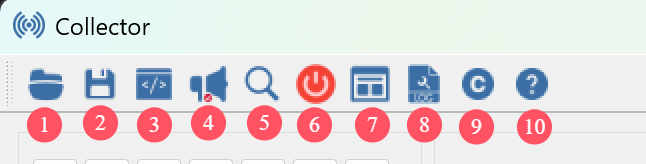
</div>


1. **导入配置**：从 JSON 文件导入模块配置信息，恢复上一次保存的界面状态。

2. **导出配置**：将所有模块配置导出为 JSON 文件，便于后续复用。

3. **自动分配 ID**：一键为所有模块重新分配 CAN 报文起始 ID，避免冲突或遗漏。

4. **通知模块工作**：向所有在线模块广播进入工作命令，模块开始周期输出 CAN 报文。

5. **模块发现**：广播模块发现命令，扫描当前 CAN 总线中的所有在线模块。

6. **CAN设备管理**：弹出【CAN设备管理】界面或快速关闭CAN设备。

7. **模块预配置**：弹出【模块预配置】界面。

8. **调试日志设置**：配置日志记录文件，开发人员调试程序时使用。

9. **版本信息**：查看软件/硬件版本。

10. **关于**：打开帮助文档。

---

### 2.3.2 模块管理（左侧）

左侧面板用于**模块的管理与树状展示**，结构与按钮说明如下：

- **模块分类树**：以模块类型分类展示（如：Temperature、Voltage、Current、Frequency）
  - 每个类别下显示对应的模块实例（如 Current_1、Voltage_2）
  - 双击模块类型可展开/折叠模块列表
  
- **模块操作按钮**：

<div style="text-align: center;">
  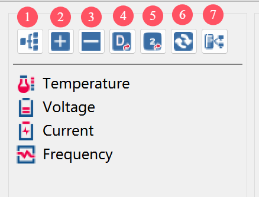
</div>


1. **自动创建模块**：广播模块发现命令，自动识别当前在线模块并在模块树中创建节点。**推荐在打开CAN卡后执行**。
2. **添加模块**：手动添加一个模块节点，用于特定场景下的离线配置或预配置。
3. **删除模块**：删除选中的模块节点。
4. **导出 DBC 文件**：将当前所有已配置模块的 CAN 信号描述导出为标准 `.dbc` 文件，供 CAN 工具（如**FKMaster**、 CANoe、PCAN 等）使用。
5. **合并 DBC 文件**：将当前所有已配置模块的 CAN 信号描述合并到现有 的.dbc文件，适用于模块数量较多或跨项目整合。
6. **模块绑定**：将当前类型下的模块节点与实际在线模块设备进行一对一绑定，下发配置参数。
7. **自动绑定模块**：对所有模块节点与模块设备进行一对一绑定操作，下发配置参数。配置信息同步完成以后通知模块进入工作状态。**推荐在“自动创建模块”后执行**。


模块管理与主界面右侧的模块配置联动。

---

### 2.3.3 模块配置（右侧）

此区域随左侧选中的模块不同而动态变化，分为两个子区域：

- **模块参数配置**：

  - 模块输出CAN 报文起始 ID（十六进制）
  - 采集周期（单位：ms）

> 例如设置为 `0x501` 和 `100`，表示该模块采集的CAN数据报文 ID从 `0x501` 开始，周期 100ms 采集一次

- **模块通道配置**：通道配置区域分为左右两个部分，分别是**通道信号表格**和**通道配置表格**。
  - **通道信号表格**：
  
    **通道（Channel）**：只读，显示模块中的各个通道名称，例如 `CurrentFD01`、`CurrentFD02`。
  
    **信号名称（Signal Name）**：可编辑，每个通道对应的信号名称，例如 通道`CurrentFD01` 对应的信号可以自定义名称为 `SignalCurrentFD01` 或其他有意义的名称。
  
    通道名称和信号名称默认命名规则为：模块类型（Current）+ CAN报文类型（FD表示CANFD，CAN不添加）+通道号（01）
  
  - **通道配置表格**:
  
    **信号单位（Value Unit）**：显示信号的物理单位，例如 `uA`、`V`、`Hz`。
  
    **信号最小值（Min Value） / 信号最大值（Max Value）**：这些数值定义了信号的有效范围。
  
    **信号因子（Factor）**：调整信号的比例因子，例如从电流传感器输出信号的范围转换为实际电流值时使用。
  
    **信号偏移量（Offset）**：用于调整信号输出的偏移量，确保输出值的精确性。
  
    **曲线配置（Curve Config）**：点击此按钮进入信号的插值配置界面。通过插值，您可以调整信号的最大/最小值、因子、偏移量等，达到精确的数据校准效果。
  
    **通道（Channel）**：选择需要配置的通道号，有些通道会输出两条信号，因此这里需要配置两条信号中某一个信号的相关配置即可对模块相应的通道完成配置。
  
    **采样档位（Sampling Gear）**：为模块通道配置采样档位。
  
    **输出电压（Output Voltage）**：为模块通道配置输出电压，若不使用则选择 `NC`（无连接）。
  
    需要注意的是：后面的几个配置只有**电压和频率**模块通道配置时才会使能。

---

### 2.3.4 状态栏（底部）

暂未启用，目前只显示版本信息。

---

## 3. 功能模块说明

### 3.1 模块绑定

系统支持模块绑定、解绑、快速绑定、快速解绑，以及设置模块为“工作模式”或“配置模式”。

该界面用于手动绑定操作，一般情况下建议使用【**自动绑定模块**】。

<div style="text-align: center;">
  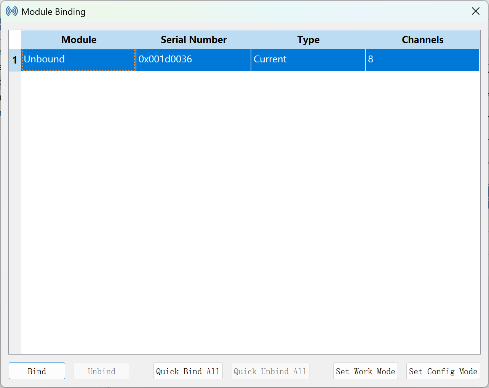
</div>

---

🔹 模块绑定原理

模块绑定是将当前在线的模块设备与模块树中已创建的模块节点进行一一对应，使设备接收并同步节点中的配置信息（如起始 ID、采集周期、输出电压等）。

绑定后，模块设备将按照分配的参数进行数据采集与 CAN 报文发送。

---

🔹 绑定规则与机制

- **按模块类型绑定**：所有绑定行为都是按模块类型进行的，仅能在同类型模块间进行配对。
- **Quick Bind All 示例说明**：
  - 若当前列表中有 3 个温度模块节点，且在线设备中也有 3 个温度模块，点击 **Quick Bind All** 后将自动一一匹配。
  - 若模块节点数量多于设备，仅前 N 个节点会被绑定，剩余节点保持未绑定；
  - 若设备多于节点，超出的设备不会绑定任何模块，无法进行配置。

---

🔹 控件功能说明（对应图中按钮）

1. **Bind**：绑定选中的设备与模块节点，弹出选择窗口（如下图所示）。

2. **Unbind**：解绑选中行当前已绑定的模块节点，使设备恢复为未绑定状态。

3. **Quick Bind All**：自动将当前模块类型下所有设备与模块节点一一绑定。

4. **Quick Unbind All**：将当前模块类型下所有设备解绑，清除所有绑定关系。

5. **Set Work Mode**：下发进入工作命令，使模块开始周期性发送采集报文。

6. **Set Config Mode**：将模块设置为配置状态，准备接受配置参数。

   选中表格某行时，**选中的模块对应设备的指示灯会闪烁**，这样就可以知道当前操作的是哪台设备了（部分硬件设备可能没有指示灯）
   
   **双击表格行时，自动拷贝模块序列号到剪切板**。

<div style="text-align: center;">
  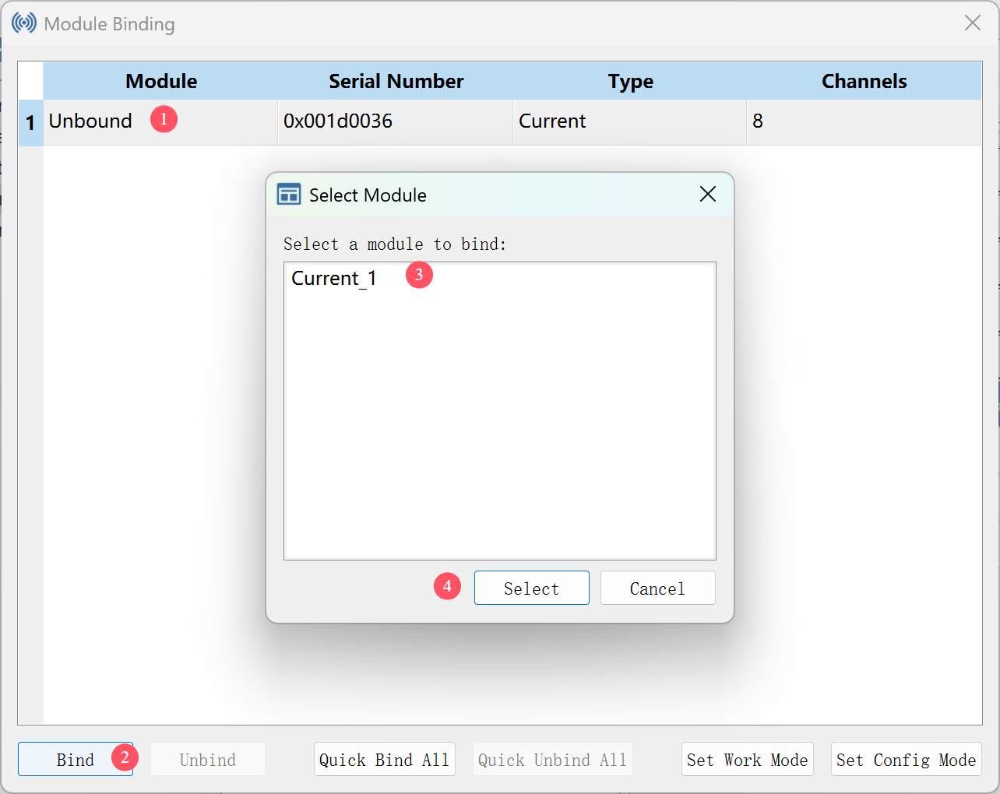
</div>

---

🔹 注意事项

- 使用绑定功能前需确保：
  - 已成功连接 CAN 卡并完成模块发现；
  - 模块节点已通过“自动创建模块”或“添加模块”方式建立；
- 若设备或节点调整，建议先点击 **Quick Unbind All** 后再执行新一轮绑定；
- 同一设备在绑定前显示为 `Unbound` 状态，绑定后显示为对应模块名。

---

### 3.2 信号曲线配置

系统支持对特定模块的通道信号进行曲线插值配置，实现线性转换与参数自动计算。

该功能主要适用于**电压模块**与**频率模块**，可通过配置两点插值范围，实现对信号的最大/最小值、缩放因子（Factor）和偏移量（Offset）等参数的自动调整。

<div style="text-align: center;">
  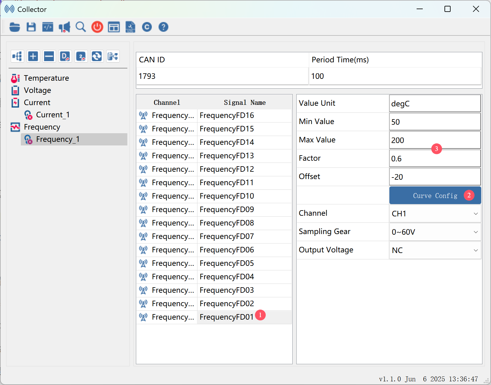
</div>

<div style="text-align: center;">
  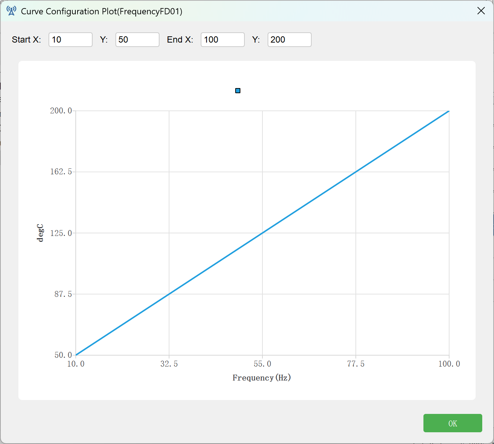
</div>

🔹 功能入口：

在通道配置界面中，支持曲线配置的通道右侧会显示【Curve Config】按钮。点击该按钮将进入插值配置界面。

🔹 插值配置界面说明：

如图所示，用户可在界面上直接输入两组坐标点：

- **Start X / Y**：起始采样值与其对应的物理值  
- **End X / Y**：结束采样值与其对应的物理值

系统将根据这两组插值点自动计算线性变换关系，并同步更新通道的以下字段：

- **Min Value / Max Value**：根据 Y 轴范围自动设置信号上下限
- **Factor**：由线性斜率计算得出，决定信号缩放比例
- **Offset**：由线性关系推导得出，决定信号基线偏移

> 示例：设置 Start X = 10，Y = 50；End X = 100，Y = 200，则系统会自动计算出：
> - Max = 200，Min = 50
> - Factor = 0.6，Offset = -20

设置完成后点击【OK】，配置将保存并立即反映在通道参数中。

🔹 注意事项：

- 仅电压模块与频率模块支持该功能，其他模块类型将不显示“Curve Config”按钮。
- 插值计算基于线性映射关系，不支持多段非线性或自定义曲线。
- 设置曲线后，通道的 `Min/Max/Factor/Offset` 值将被覆盖为插值结果，请谨慎调整。

---

## 4. 快速入门

本节将引导用户在**最短时间内完成模块配置与数据采集**，适合首次使用者或快速调试场景。

只需按照以下步骤点击几个按钮，即可让模块设备开始采集并输出 CAN 报文。

------

✅ **第一步：启动软件，配置 CAN 设备**

打开程序后，会自动弹出【CAN设备管理】界面：

1. 点击【Open Device】打开采集设备；
2. 点击【Start CANx】打开通道（即连接采集卡的CAN通道，如 CAN1 或 CAN2）；
3. 确保设备已连接，波特率与模块一致。

> 若需修改采样率、终端继电器等，请点击“高级选项”进入扩展配置界面。

------

✅ **第二步：模块预配置（可跳过）**

关闭设备管理界面后，会自动弹出【模块预配置】界面。

该界面已提供默认参数，**无需手动修改**。如有特殊需求，可配置：

- 模块输出报文类型（建议使用 CAN FD）
- 模式输出默认起始帧 ID（避免与其他模块冲突）
- 模块采集周期（推荐 100ms）
- 模块设备发现时间（决定模块搜索时长）

配置完成后，点击【OK】即可。

------

✅ **第三步：自动创建模块节点**

进入主界面后，点击模块操作按钮中的【自动创建模块】。

系统将广播模块发现命令，自动在左侧模块树中添加所有在线设备对应的模块节点，并自动生成模块的配置参数（如CAN ID、Period Time）。

🟢 提示：此步骤完成后，设备尚未工作，仅完成对应的模块节点创建。

------

**✅ 第四步：自动绑定模块设备**

点击模块操作按钮中的【自动绑定模块】：

- 系统将当前在线设备与已创建的模块节点**一一绑定**
- 同时同步模块配置信息（如CAN ID、Period Time）到设备
- 并向所有在线设备广播进入工作命令，设备立即开始输出 CAN 报文

此时，设备正式进入工作状态，可在 CAN 工具中看到实时报文。

------

**✅ 第五步：导出 DBC 文件（可选）**

设备工作后，建议点击模块操作按钮中的【导出 DBC 文件】按钮，将当前所有模块的信号定义导出为标准 `.dbc` 文件。

------

**✅ 补充说明（进阶用户）**

若需自定义模块或通道参数（如信号名称、单位、插值曲线等），请进入模块树中双击节点，按以下章节进行详细配置：

- **模块参数配置**（起始 ID、采集周期等）
- **通道信号配置**（单位、Min/Max、Factor 等）
- **插值曲线设置**（适用于电压/频率模块）
- **手动绑定模块设备**（Bind 界面）

详细请参见第 2.3.3 和第 3 章内容。

------

**✅ 总结：推荐流程回顾**

```text
启动程序
 → 打开设备与通道（CAN设备管理）
 → （可选）确认模块预配置参数
 → 自动创建模块
 → 自动绑定模块 → 设备开始工作
 → 导出DBC（可选）
```

整个流程 1~2 分钟内即可完成，适合绝大多数通用采集场景。

---
