### Switch CAN软件使用说明书

> 版本：v3.0.0 | 作者：leiwei | 日期：2025-05-26 

[TOC]

### 1. 概述

Switch CAN 是一款专为 CAN（控制器局域网）网络设计的测试工具，广泛应用于 **PVE (Protocol Validation and Evaluation- 协议验证与评估测试)** 实验中，用于验证 CAN 网络的通信容错和功能安全能力。软件支持报文转发、过滤和故障注入，帮助用户模拟和测试 CAN 网络在各种场景下的表现。

### 2. 设备管理

启动 Switch CAN 软件后，会显示两个界面：
- **设备管理界面**（置顶）：用于连接设备、设置通道以及显示设备状态。
- **主界面**（背景）：用于监控和管理 CAN 报文。

设备管理界面可通过“测试”（Test）菜单中的“打开设备”（Open Device）或工具栏的“打开设备”按钮进入。

    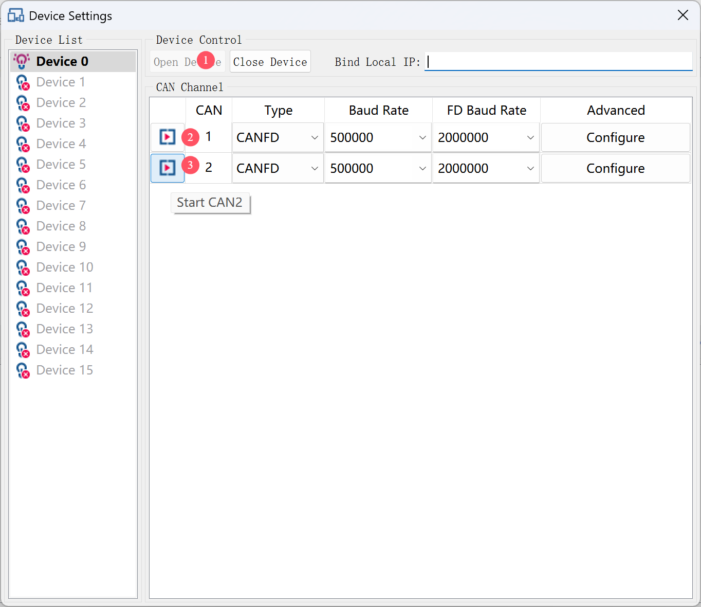

界面分为：

- **左侧**：设备列表，鼠标悬停显示设备和 CAN 通道状态。

    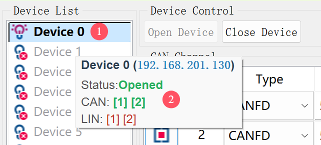

- **右侧**：
  - **上部**：包含“打开设备”（Open Device）和“关闭设备”（Close Device）按钮，以及绑定本地 IP 输入框（用于多网卡场景）。
  
  - **下部**：CAN 通道配置表格，包含“打开通道”（Start CANx）和“关闭通道”（Stop CANx）按钮。可设置参数，点击“高级选项”配置采样率和终端继电器。

    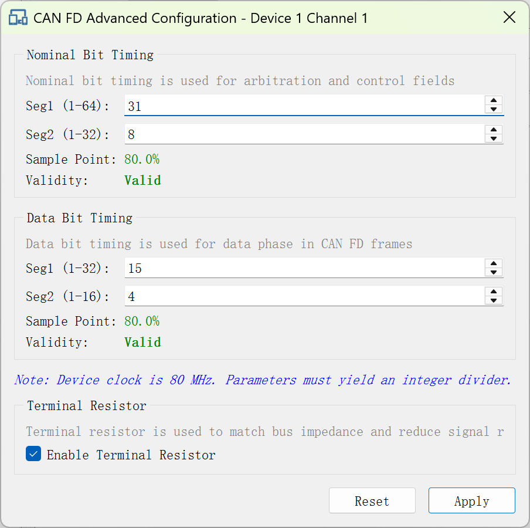

    **注意**：确保波特率与对端设备匹配，否则会报错。

### 3. 主界面

主界面是 CAN 测试的核心区域，启动时自动加载上次的过滤和故障信息。

    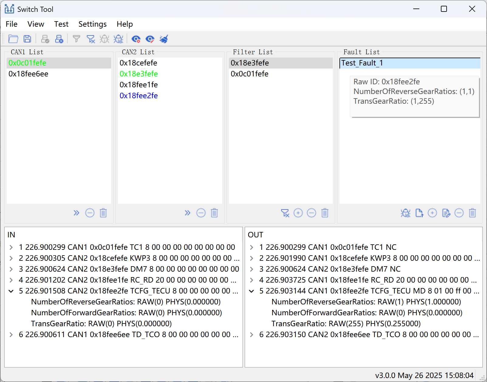

主界面从上到下，从左到右依次为：

- **菜单栏**
- **工具栏**
- **CAN1列表**、**CAN2列表**、**过滤列表**、**故障列表**
- **IN视图**、**OUT视图**

#### 3.1 菜单栏

- **文件（File）**：
  - 打开测试脚本（Open Test Script）：加载已有脚本。
  - 保存测试脚本（Close Test Script）：保存过滤和故障配置。
- **视图（View）**：
  - 总线负载窗口（BusLoad Window）：显示负载率。
  - 日志输入窗口（Log In Window）：显示/隐藏接收日志。
  - 日志输出窗口（Log Out Window）：显示/隐藏发送日志。
  - 过滤窗口（Filter Window）：显示/隐藏过滤列表。
  - 故障窗口（Fault Window）：显示/隐藏故障列表。
  - 重置窗口（Reset Window）：恢复默认布局。
- **测试（Test）**：
  - 打开设备（Open Device）：弹出设备管理界面，进行设备连接、通道使能。
  - 关闭设备（Close Device）：快速断开设备。
  - 启动过滤（Start Filter）：启用过滤功能。
  - 停止过滤（Stop Filter）：禁用过滤功能。
  - 启动故障（ Start Fault）：启用故障注入。
  - 停止故障（ Stop Fault）：禁用故障注入。
  - 清空日志（Clear Log）：清除 CAN1/CAN2列表、IN/OUT 数据。
- **设置（Settings）**：
  - 日志视图配置（ Log View Configure）：设置 IN/OUT 视图显示方式（原始报文或 DBC）。
  - 日志视图过滤（ Log View Filter）： IN/OUT 视图数据筛选，支持通道或报文类型过滤。
  - 日志记录（Log Record）：实时录制CAN报文，支持录制CSV、ASC格式报文。
  - 调试日志设置（Debug Log Settings）：系统调试时使用（谨慎使用，会占用cpu以及系统磁盘）。
  - 显示时间设置（Display Time Settings）：设置 IN/OUT 视图时间显示格式。
- **帮助（Help）**：
  - 关于（About）：本软件说明文档。
  - 设备版本（Device Version）：查看连接设备的版本信息。

#### 3.2 工具栏

    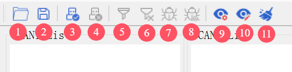

1. 打开测试脚本（Open Test Script）：加载已有脚本。
2. 保存测试脚本（Close Test Script）：保存过滤和故障配置。
3. 打开设备（Open Device）：弹出设备管理界面，进行设备连接、通道使能。
4. 关闭设备（Close Device）：快速断开设备。
5. 启动过滤（Start Filter）：启用过滤功能。
6. 停止过滤（Stop Filter）：禁用过滤功能。
7. 启动故障（ Start Fault）：启用故障注入。
8. 停止故障（ Stop Fault）：禁用故障注入。
9. 日志视图配置（ Log View Configure）：设置 IN/OUT 视图显示方式（原始报文或 DBC）。
10. 日志视图过滤（ Log View Filter）： IN/OUT 视图数据筛选，支持通道或报文类型过滤。
11. 清空日志（Clear Log）：清除 CAN1/CAN2列表、IN/OUT 数据。

#### 3.3 报文列表

- **CAN1/CAN2 列表**：显示接收的报文 ID，颜色表示：
  - **黑色**：报文接收并转发。
  - **绿色**：报文被过滤（未转发，OUT 视图报文显示 **NC**标识）。
  - **蓝色**：报文经故障注入修改后发出（OUT 视图报文显示 **MD**标识）。
  - **红色**：异常报文（硬件/软件错误）。
- **操作**：

    

  1. 添加 ID 到过滤列表（或双击添加）
  2. 删除 ID
  3. 清空列表

#### 3.4 过滤列表

显示需要过滤的报文ID，启用过滤功能后，过滤列表中对应的ID报文将不会被转发。

CANx列表该报文ID会以**绿色**显示（CANx表示接收该ID的CAN通道）。

OUT视图中该报文添加**NC**标识。

- **操作**：

    

  1. 启动/停止过滤
  2. 添加过滤ID
  3. 删除过滤ID（或双击删除）
  4. 清空列表

#### 3.5 故障列表

显示需要注入的故障名称，鼠标悬停时会显示故障注入的报文ID（故障ID）、信号信息（factor、offset值）。启用故障功能后，当收到故障列表中对应的ID报文时，报文会被修改后再转发。

CANx列表该报文ID会以**蓝色**显示（CANx表示接收该ID的CAN通道）。

OUT视图中该报文添加**MD**标识。

- **操作**：

    

  1. 启动/停止故障
  2. 导入故障
  3. 添加故障
  4. 编辑故障（或双击编辑）
  5. 删除故障
  6. 清空列表

#### 3.6 日志视图

- **IN 视图**：显示接收的报文。
- **OUT 视图**：显示发送的报文，包括过滤（**NC**）或修改（**MD**）报文。

#### 3.7 总线负载

下图显示的是CAN1、CAN2通道当前负载情况，结合主界面的CAN1、CAN2接收列表可以看出。

单位时间内（1秒），CAN1接收3条，CAN2接收4条。

其中CAN2接收到的报文被过滤了2条，因此CAN1发出的报文只有2条。

CAN2发出3条（即转发CAN1的报文）。

    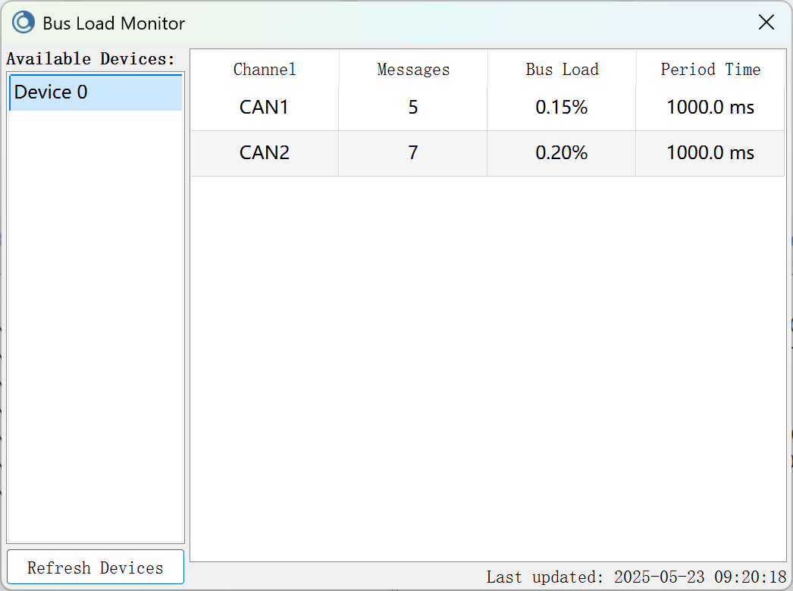

### 4. 过滤测试

- **开始过滤**

  1. 点击“启动过滤”按钮

  2. 在 CAN1/CAN2 列表选择报文 ID，点击“添加到过滤”或双击。

     此时报文ID 出现在过滤列表中，并且CANx 列表该报文 ID 变为**绿色**。OUT视图中该报文添加**NC**标识。

- **停止过滤**

  1. 点击“停止过滤”按钮

     **大约10秒**后，CANx列表中该报文 ID 恢复为**黑色**。OUT视图中该报文无**NC**标识。

### 5. 故障注入

故障注入功能是根据故障 ID 匹配接收的报文ID，匹配成功以后根据故障信息修改，修改完成后转发。

点击“添加故障”/“修改故障”按钮或双击故障名称，进入故障编辑界面。

    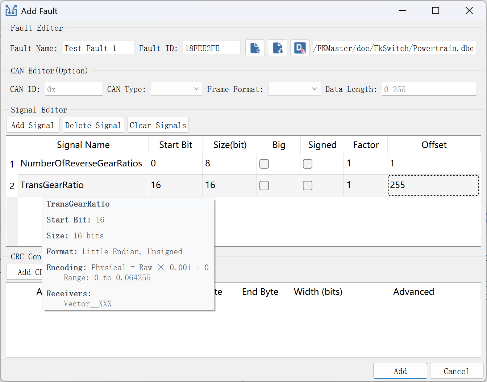

故障界面分为四个部分：

- **故障编辑**：故障名称、故障ID（接收的报文ID）、导出故障文件、导入故障文件、导入DBC文件、DBC文件路径。
- **CAN 报文编辑**：更改ID、CAN类型修改（CAN/CANFD/CANFDBRD）、帧类型修改（standard/extend）、长度修改。
- **信号编辑**：新增信号、删除信号、清空信号、信号表格。
- **CRC 编辑**：新增CRC、删除CRC、清空CRC、CRC表格。

一个完整的故障信息必须包含以下信息：

1. **故障名称**
2. **故障ID**（用于匹配接收的报文ID）
3. **CAN报文信息或者信号信息**（两者至少取其一）

#### 5.1 信号值修改

故障注入时会根据信号定义从CAN报文中获取信号原始值，然后原始值与因子和偏移量进行计算得到新的信号值。将新值覆盖原始值后发送出去。

信号定义支持以下编辑方式：

1. 基于 DBC 文件：
   - 点击“导入 DBC 文件”加载文件。
   - 点击“新增信号”，选择信号（可多选），选择完以后，信号的消息 ID 自动填充为故障 ID。
   - 在信号表格中编辑因子和偏移量。

    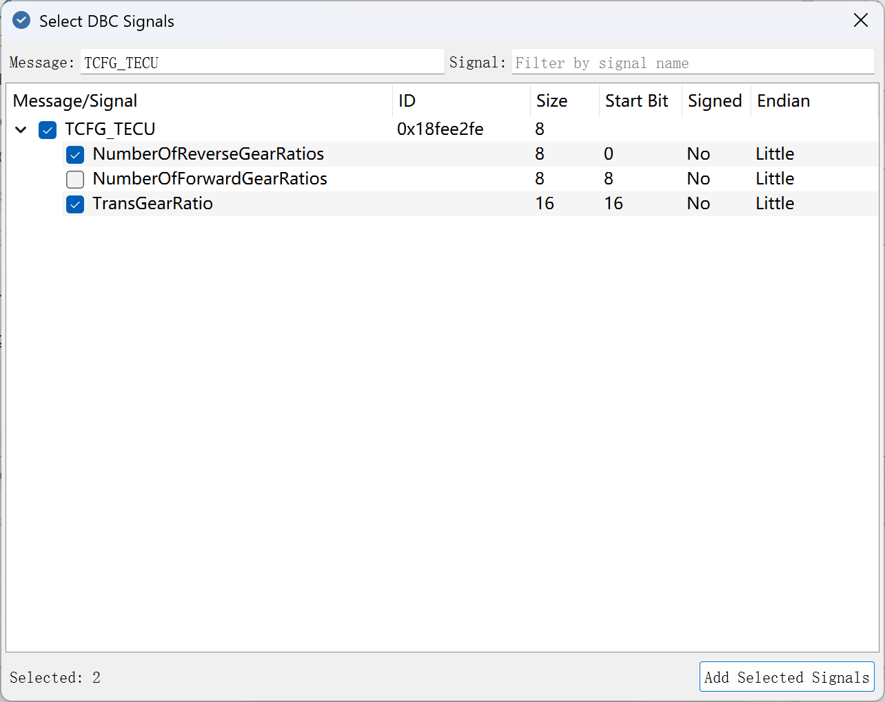

2. 手动编辑：
   - 点击“新增信号”。
   - 编辑信号名称、信号起始位、信号长度、是否大端、是否有符号、因子和偏移量。

信号选择支持消息名称和信号名称过滤，当DBC文件定义的消息很多时，使用过滤功能，可快速定位需要新增的信号。

#### 5.2 校验值修改

故障注入中，有的CAN报文需要进行内部校验。因此需要修改相应的CRC的值。

CRC定义支持以下算法：

- CRC-4/ITU, CRC-5/EPC, CRC-5/ITU, CRC-5/USB, CRC-6/ITU, CRC-7/MMC, CRC-8, CRC-8/ITU, CRC-8/ROHC, CRC-8/MAXIM
- CRC-16/IBM, CRC-16/MAXIM, CRC-16/USB, CRC-16/MODBUS, CRC-16/CCITT, CRC-16/CCITT-FALSE, CRC-16/X25, CRC-16/XMODEM, CRC-16/DNP
- CRC-32, CRC-32/MPEG-2

CRC定义支持的配置项：

- 算法类型、CRC 起始位、校验起始字节、校验结束字节、CRC位宽。
- 高级选项：是否大端、输入反转、输出反转、多项式、初始值、异或值。

    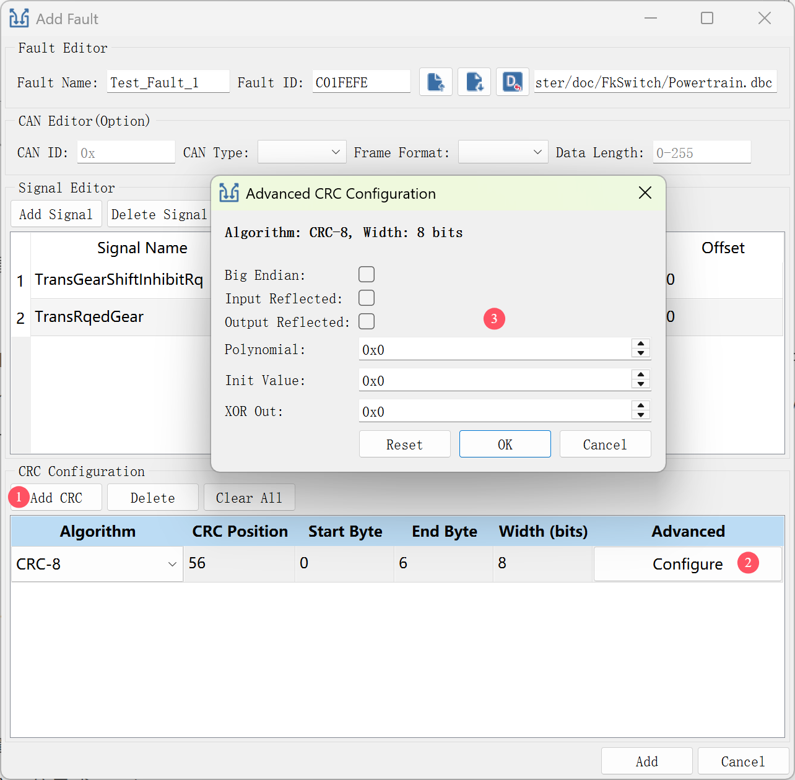

#### 5.3 测试方法

- **开始故障注入**
  1. 点击“启动故障”按钮，此时CANx 列表该报文ID（即故障 ID） 变为**蓝色**。OUT视图中该报文添加**MD**标识。
- **停止故障注入**
  1. 点击“停止故障”按钮，**大约10秒**后，CANx列表该报文ID（即故障 ID）恢复为**黑色**。OUT视图中该报文无**MD**标识。

### 6. 日志管理

#### 6.1视图设置

日志视图默认显示的是原始报文，支持DBC显示，点击“日志视图配置”按钮进入配置界面进行设置。

- 勾选"原始报文(Raw Message)"按钮，再点击"应用(Apply)"按钮，日志视图显示的是原始报文。
- 勾选"显示DBC信号(Show DBC Signals)"按钮并点击"导入(Import)"按钮导入DBC文件后，再点击"应用(Apply)"按钮。日志视图会按照DBCF定义的信号显示报文。

    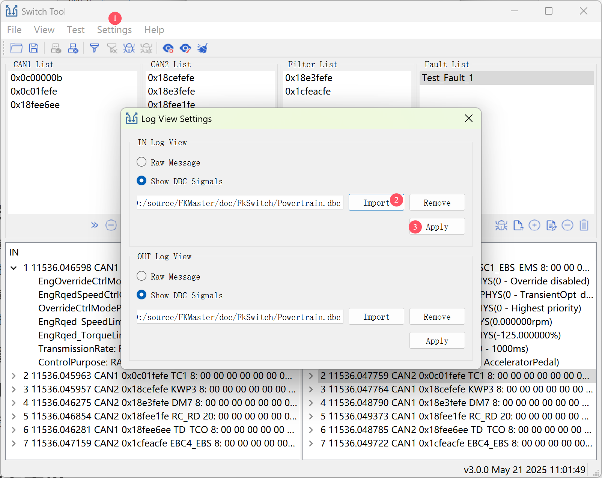

#### 6.2报文过滤

日志视图支持过滤功能，点击“日志视图过滤”按钮进入过滤界面进行设置。

    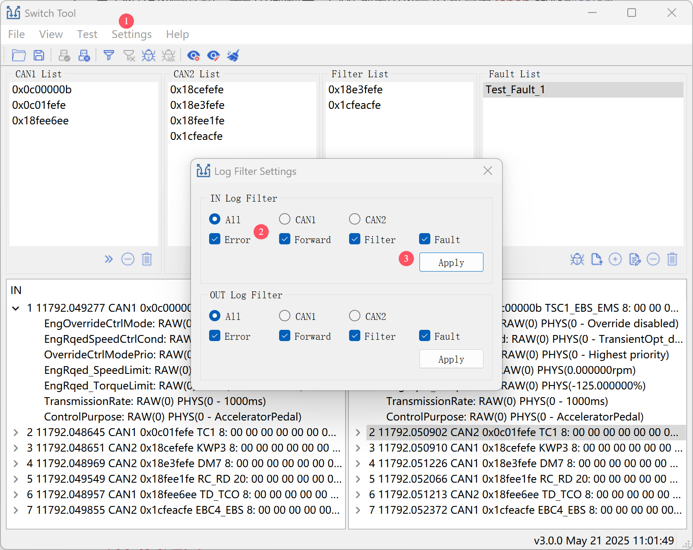

#### 6.3报文录制

支持在线录制CSV和ASC格式报文，可点击“日志录制”按钮进入录制界面进行操作。

    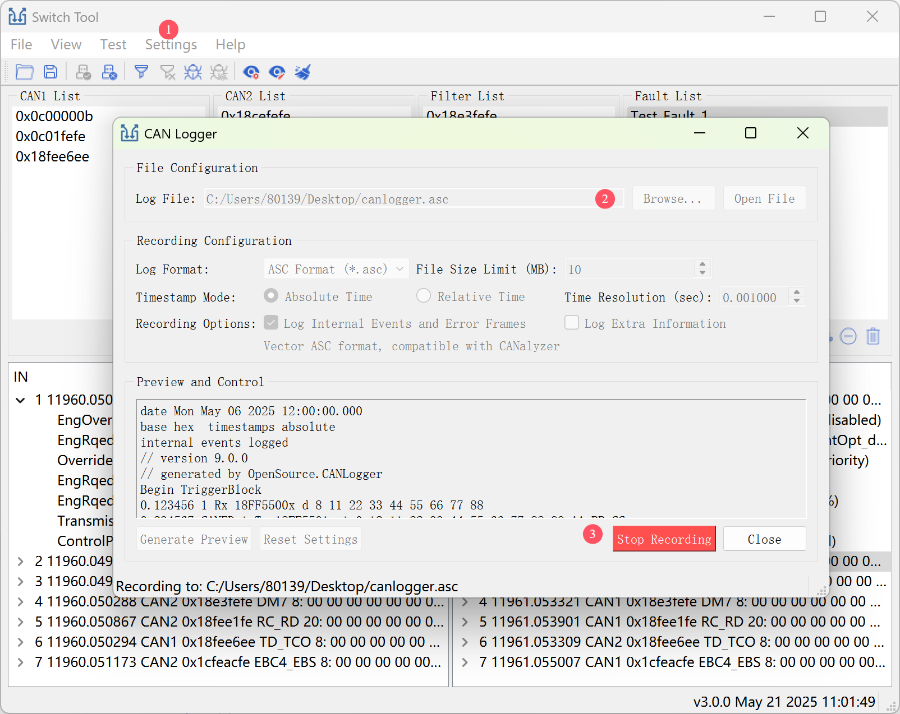

#### 6.4时间设置

日志视图默认显示相对设备的时间，可点击“显示时间设置”按钮进入设置界面进行操作。

    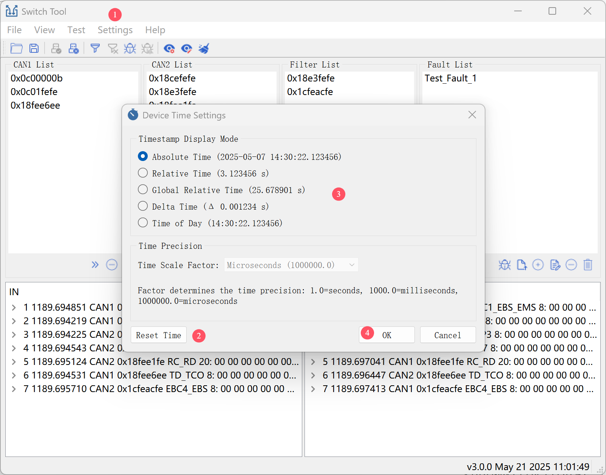

**注意：**设置时间显示格式前，建议重置时间。

### 7. 界面自定义

- 放大/缩小界面。
- 拖动工具栏。
- 调整 CAN1/CAN2、过滤、故障列表大小。
- 通过“视图”菜单显示/隐藏窗口。
- 鼠标悬停IN/OUT视图顶部，上下调整布局
- 鼠标IN/OUT视图中间，左右调整布局

### 8. 注意事项

- 确保两端设备波特率匹配。
- 确保终端连接120欧电阻。
- 谨慎使用调试日志，避免资源占用。
- 定期保存测试脚本。

## ? 技术支持

- **邮箱**: wei.lei@figkey.com
- **官网**: https://www.figkey.com

## ? 版权声明

版权所有 ? 2025 丰柯科技。保留所有权利。  
