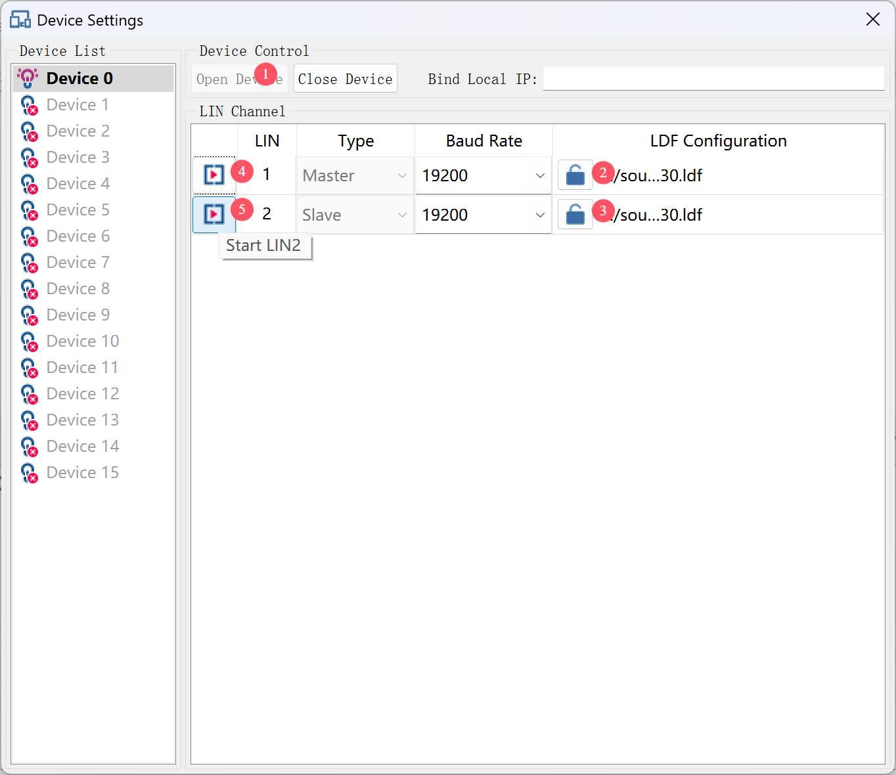
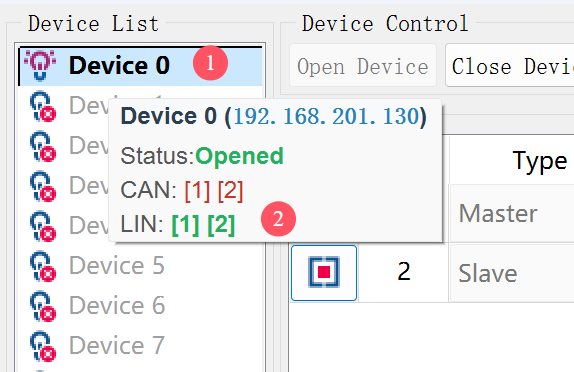
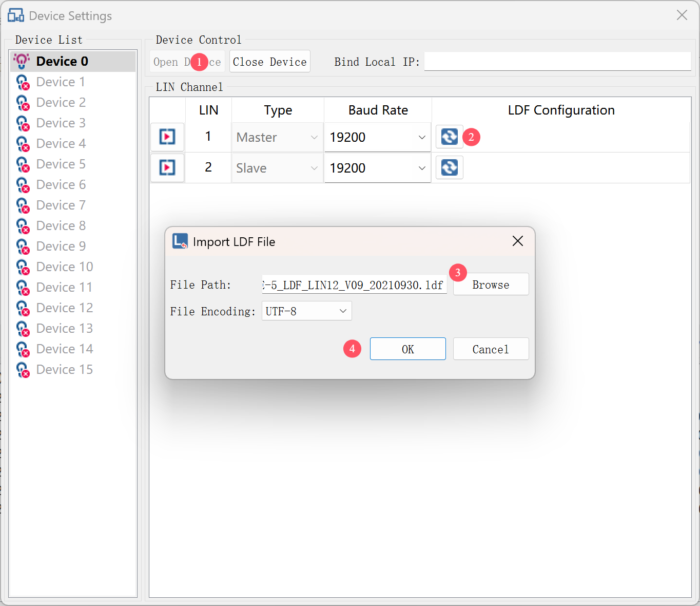
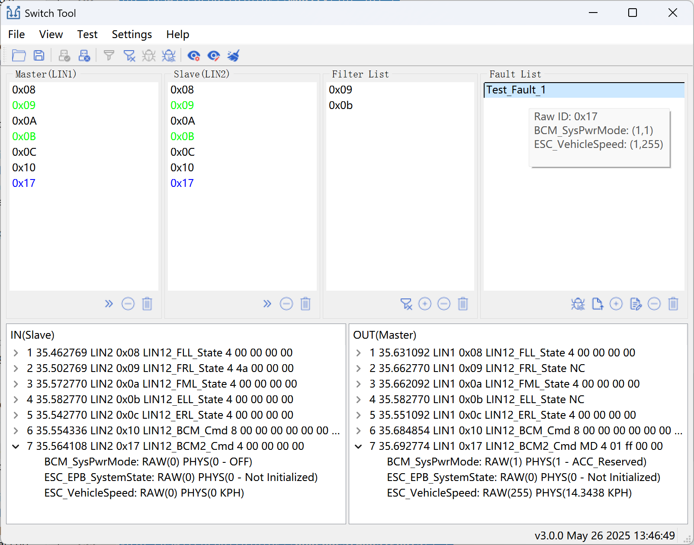
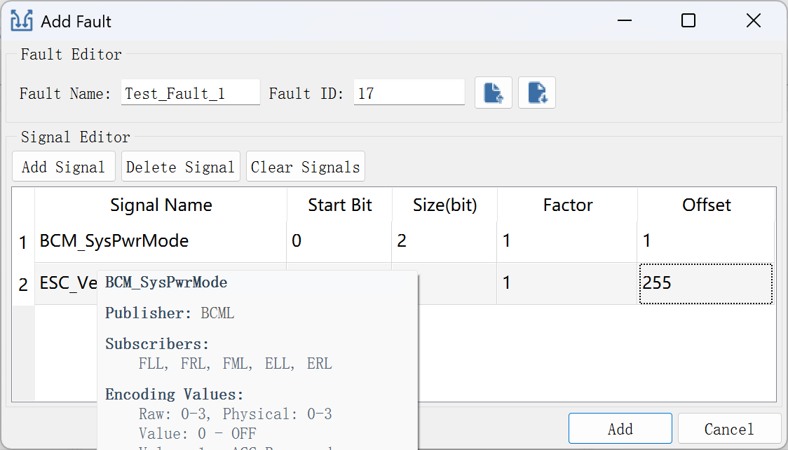
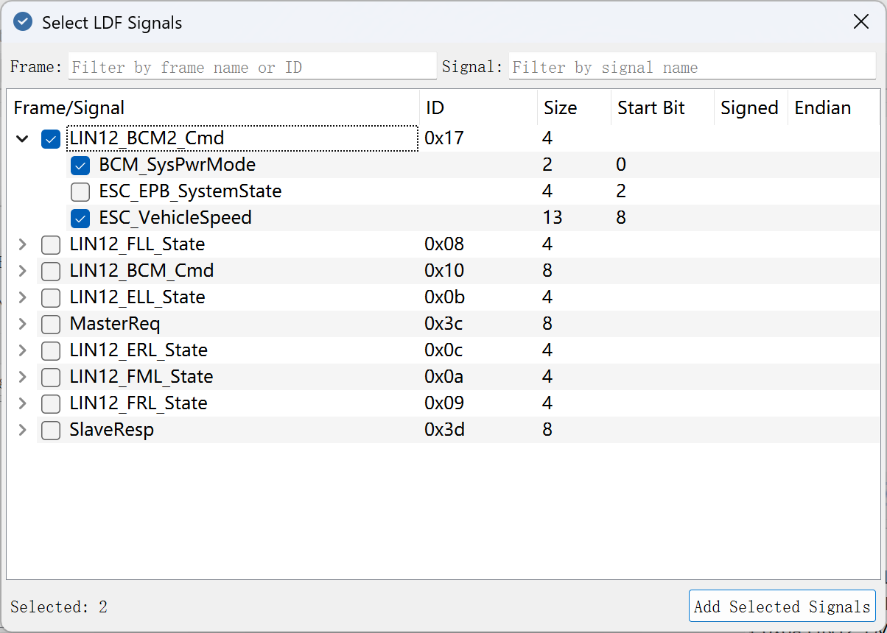
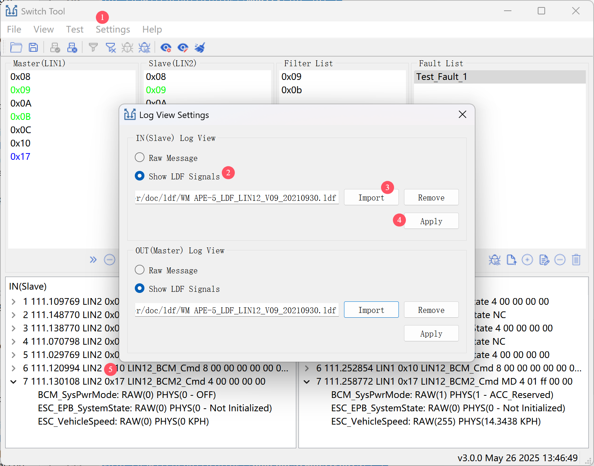
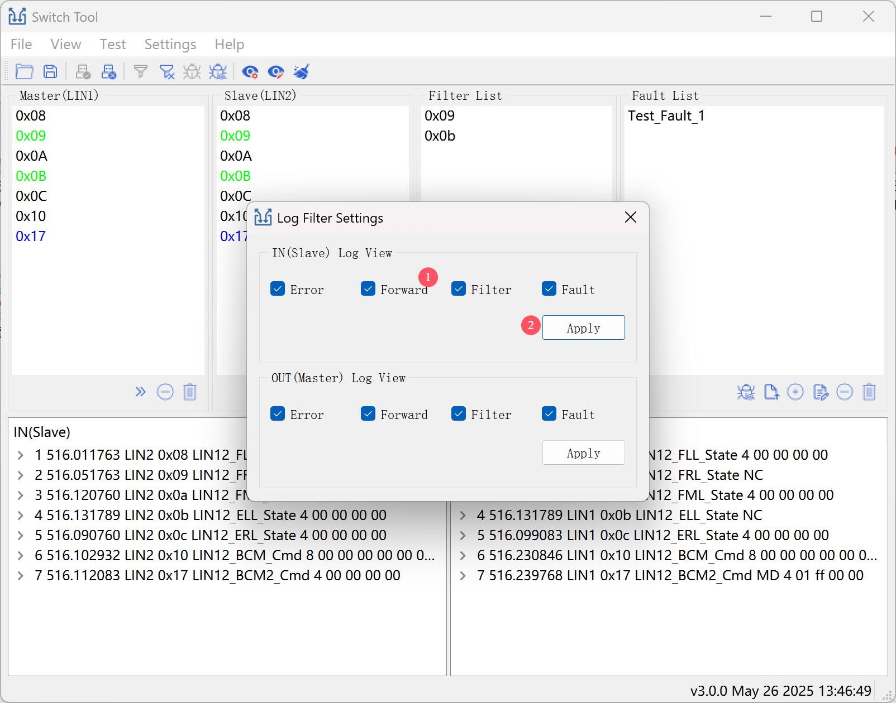
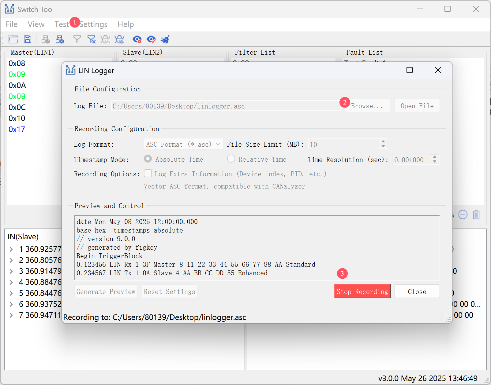
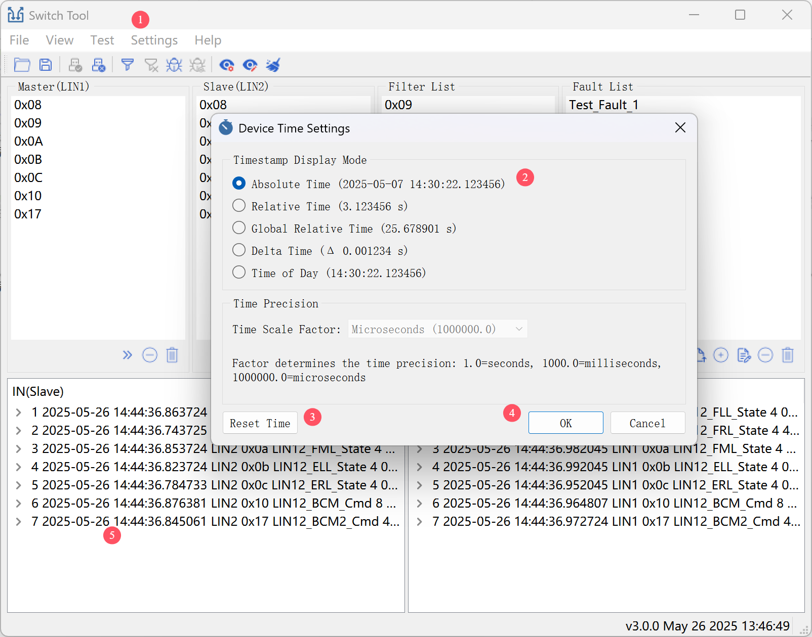

### Switch LIN软件使用说明书

**版本号：3.0.0**  

[TOC]

### 1. 概述

Switch LIN 是一款用于 LIN（局部互连网络）通信测试的专业工具，广泛应用于 **PVE（Protocol Validation and Evaluation - 协议验证与评估测试）** 场景，帮助用户模拟车载主从通信过程并进行故障注入。该软件支持报文转发、报文过滤、信号修改（故障注入）功能，可用于验证 LIN 网络在不同工况下的鲁棒性与功能安全性。

**软件功能：**

1. 设备管理：提供设备与通道开关，支持多设备测试，支持LDF文件绑定，实时监控设备与通道状态。

2. 报文过滤：系统接收的报文ID与过滤列表中报文ID进行匹配，若匹配成功，则此报文不会被转发（即丢弃此报文）。

   主/从节点列表该报文 ID 变绿色。输出视图中该报文添加过滤（NC）标识。

3. 故障注入：系统接收的报文ID与故障列表中故障ID进行匹配，若匹配成功，则此报文会被修改以后转发出去。修改是基于故障信号配置中的因子（factor）与偏移量（offset）对信号值进行实时计算与覆盖。

   主/从节点列表该报文 ID 变蓝色。输出视图中该报文添加修改（MD）标识。

4. 日志管理：提供原始报文与LDF信号两种显示方式，支持按报文类型（错误/转发/过滤/故障）进行过滤，支持在线录制CSV/ASC格式文件，支持多种时间格式显示（绝对/相对/Delta）。

5. 文件管理：支持导入/导出故障文件，支持导入/导出测试脚本。

**软件特色：**

1. 全流程仿真：支持主节点（LIN1）与从节点（LIN2）双通道并行管理，IN/OUT 视图分离，直观监控数据流向。
2. 色彩编码：绿色＝报文被过滤（NC）；蓝色＝报文被修改（MD）；黑色＝正常收发；红色＝异常报文。
3. 灵活过滤：一键添加/删除过滤 ID，一键使能过滤功能。
4. 故障注入：故障编辑时支持按消息名称或信号名称筛选信号，支持快速预览信号附加信息。自动填充故障名称、故障ID，支持快速预览故障信息，一键使能故障功能。
5. 界面友好：自动缓存/加载历史数据，支持拖拽、隐藏/还原任意窗口，分区缩放与布局重置，满足多种测试习惯。

**特别说明：**

程序运行前：本机网卡设置为 192.168.201.X（避开设备 IP 段：130～145），**确保可 ping 通设备**（设备0默认 IP： 192.168.201.130，设备x默认 IP： 192.168.201.130+x）。

本软件定义**LIN1通道**  为 **主节点（ Master）**，**LIN2通道 **为**从节点（Slave）**。外部接入的时候，**LIN1通道**接被测**产品（ECU**），**LIN2通道**接**主机(车端)**。

输入视图显示**Slave节点**报文（即从**主机**发出的报文），输出视图显示 **Master节点**报文（即下发给**ECU**的报文）。

### 2. 设备管理

启动 Switch LIN 软件后，会显示两个界面：

- **设备管理界面**（置顶）：用于连接设备、设置通道以及显示设备状态。
- **主界面**（背景）：用于监控和管理 LIN 报文。

设备管理界面可通过“测试”（Test）菜单中的“打开设备”（Open Device）或工具栏的“打开设备”按钮进入。

    

界面分为：

- **左侧**：设备列表，鼠标悬停显示设备和 LIN 通道状态。

    

- **右侧**：
  - **上部**：包含“打开设备”（Open Device）和“关闭设备”（Close Device）按钮，以及绑定本地 IP 输入框（用于多网卡场景）。
  - **下部**：LIN 通道配置表格，包含“打开通道”（Start LINx）和“关闭通道”（Stop LINx）按钮。

打开设备以后，需分别绑定主从通道对应的LDF文件，绑定成功以后再打开主从通道。

    

**注意**：确保波特率与对端设备匹配，否则会报错。

### 3. 主界面

主界面是 LIN 测试的核心区域，启动时自动加载上次的过滤和故障信息。

    

主界面从上到下，从左到右依次为：

- **菜单栏**
- **工具栏**
- **Master列表**、**Slave列表**、**过滤列表**、**故障列表**
- **IN（Slave）视图**、**OUT（Master）视图**

#### 3.1 菜单栏

- **文件（File）**：
  - 打开测试脚本（Open Test Script）：加载已有脚本。
  - 保存测试脚本（Close Test Script）：保存过滤和故障配置。
- **视图（View）**：
  - 日志输入窗口（Log In Window）：显示/隐藏接收日志。
  - 日志输出窗口（Log Out Window）：显示/隐藏发送日志。
  - 过滤窗口（Filter Window）：显示/隐藏过滤列表。
  - 故障窗口（Fault Window）：显示/隐藏故障列表。
  - 重置窗口（Reset Window）：恢复默认布局。
- **测试（Test）**：
  - 打开设备（Open Device）：弹出设备管理界面，进行设备连接、通道使能。
  - 关闭设备（Close Device）：快速断开设备。
  - 启动过滤（Start Filter）：启用过滤功能。
  - 停止过滤（Stop Filter）：禁用过滤功能。
  - 启动故障（ Start Fault）：启用故障注入。
  - 停止故障（ Stop Fault）：禁用故障注入。
  - 清空日志（Clear Log）：清除 Master/Slave列表、IN/OUT 数据。
- **设置（Settings）**：
  - 日志视图配置（ Log View Configure）：设置 IN/OUT 视图显示方式（原始报文或 LDF）。
  - 日志视图过滤（ Log View Filter）： IN/OUT 视图数据筛选，支持报文类型过滤。
  - 日志记录（Log Record）：实时录制LIN报文，支持录制CSV、ASC格式报文。
  - 调试日志设置（Debug Log Settings）：系统调试时使用（谨慎使用，会占用cpu以及系统磁盘）。
  - 显示时间设置（Display Time Settings）：设置 IN/OUT 视图时间显示格式。
- **帮助（Help）**：
  - 关于（About）：本软件说明文档。
  - 设备版本（Device Version）：查看连接设备的版本信息。

#### 3.2 工具栏

    

1. 打开测试脚本（Open Test Script）：加载已有脚本。
2. 保存测试脚本（Close Test Script）：保存过滤和故障配置。
3. 打开设备（Open Device）：弹出设备管理界面，进行设备连接、通道使能。
4. 关闭设备（Close Device）：快速断开设备。
5. 启动过滤（Start Filter）：启用过滤功能。
6. 停止过滤（Stop Filter）：禁用过滤功能。
7. 启动故障（ Start Fault）：启用故障注入。
8. 停止故障（ Stop Fault）：禁用故障注入。
9. 日志视图配置（ Log View Configure）：设置 IN/OUT 视图显示方式（原始报文或 LDF）。
10. 日志视图过滤（ Log View Filter）： IN/OUT 视图数据筛选，支持报文类型过滤。
11. 清空日志（Clear Log）：清除Master/Slave列表、IN/OUT 数据。

#### 3.3 报文列表

- **Master/Slave 列表**：显示接收的报文 ID，颜色表示：
  - **黑色**：报文接收并转发。
  - **绿色**：报文被过滤（未转发，OUT 视图报文显示 **NC**标识）。
  - **蓝色**：报文经故障注入修改后发出（OUT 视图报文显示 **MD**标识）。
  - **红色**：异常报文（硬件/软件错误）。
- **操作**：

    

  1. 添加 ID 到过滤列表（或双击添加）
  2. 删除 ID
  3. 清空列表

#### 3.4 过滤列表

显示需要过滤的报文ID，启用过滤功能后，过滤列表中对应的ID报文将不会被转发。

Master/Slave列表该报文ID会以**绿色**显示。

OUT视图中该报文添加**NC**标识。

- **操作**：

    

  1. 启动/停止过滤
  2. 添加过滤ID
  3. 删除过滤ID（或双击删除）
  4. 清空列表

#### 3.5 故障列表

显示需要注入的故障名称，鼠标悬停时会显示故障注入的报文ID（故障ID）、信号信息（factor、offset值）。启用故障功能后，当收到故障列表中对应的ID报文时，报文会被修改后再转发。

Master/Slave列表该报文ID会以**蓝色**显示。

OUT视图中该报文添加**MD**标识。

- **操作**：

    

  1. 启动/停止故障
  2. 导入故障
  3. 添加故障
  4. 编辑故障（或双击编辑）
  5. 删除故障
  6. 清空列表

#### 3.6 日志视图

- **IN 视图**：显示Slave节点收到的报文，即主机发出的报文。
- **OUT 视图**：显示Master节点发送的报文，包括过滤（**NC**）或修改（**MD**）报文。

### 4. 过滤测试

- **开始过滤**

  1. 点击“启动过滤”按钮

  2. 在 Master/Slave列表选择报文 ID，点击“添加到过滤”或双击。

     此时报文ID 出现在过滤列表中，并且Master/Slave 列表该报文 ID 变**绿色**。OUT视图中该报文添加**NC**标识。

- **停止过滤**

  1. 点击“停止过滤”按钮

     **大约10秒**后，Master/Slave 列表该报文 ID 恢复为**黑色**。OUT视图中该报文无**NC**标识。

### 5. 故障注入

故障注入功能是根据故障 ID 匹配接收的报文ID，匹配成功以后根据故障信息修改，修改完成后转发。

点击“添加故障”/“修改故障”按钮或双击故障名称，进入故障编辑界面。

    

故障界面分为两个个部分：

- **故障编辑**：故障名称、故障ID（接收的报文ID）、导出故障文件、导入故障文件。
- **信号编辑**：新增信号、删除信号、清空信号、信号表格。

一个完整的故障信息必须包含以下信息：

1. **故障名称**
2. **故障ID**（用于匹配接收的报文ID）
3. **信号信息**

#### 5.1 信号值修改

故障注入时会根据信号定义从LIN报文中获取信号原始值，然后原始值与因子和偏移量进行计算得到新的信号值。将新值覆盖原始值后发送出去。

信号定义：

- 点击“新增信号”，选择信号（可多选），选择完以后，信号对应的消息 ID 自动填充为故障 ID。
- 在信号表格中编辑因子和偏移量。

    

信号选择支持消息名称和信号名称过滤，当LDF文件定义的消息很多时，使用过滤功能，可快速定位需要新增的信号。

#### 5.2 测试方法

- **开始故障注入**
  1. 点击“启动故障”按钮，此时Master/Slave 列表该报文 ID（即故障ID） 变**蓝色**。OUT视图中该报文添加**MD**标识。
- **停止故障注入**
  1. 点击“停止故障”按钮，**大约10秒**后，Master/Slave 列表该报文ID（即故障 ID） 恢复为**黑色**。OUT视图中该报文无**MD**标识。

### 6. 日志管理

#### 6.1视图设置

日志视图默认使用通道绑定的LDF文件显示报文，支持原始报文显示，点击“日志视图配置”按钮进入配置界面进行设置。

- 勾选"原始报文(Raw Message)"按钮，再点击"应用(Apply)"按钮，日志视图显示的是原始报文。
- 勾选"显示LDF信号(Show LDF Signals)"按钮并点击"导入(Import)"按钮导入LDF文件后，再点击"应用(Apply)"按钮。日志视图会按照LDF定义的信号显示报文。

    

#### 6.2报文过滤

日志视图支持过滤功能，点击“日志视图过滤”按钮进入过滤界面进行设置。

    

#### 6.3报文录制

支持在线录制CSV和ASC格式报文，可点击“日志录制”按钮进入录制界面进行操作。

    

#### 6.4时间设置

日志视图默认显示相对设备的时间，可点击“显示时间设置”按钮进入设置界面进行操作。

    

**注意：**设置时间显示格式前，建议重置时间。

### 7. 界面自定义

- 放大/缩小界面。
- 拖动工具栏。
- 调整 Master/Slave、过滤、故障列表大小。
- 通过“视图”菜单显示/隐藏窗口。
- 鼠标悬停IN/OUT视图顶部，上下调整布局
- 鼠标IN/OUT视图中间，左右调整布局

### 8. 注意事项

- 确保两端设备波特率匹配。

- 确保已接入地线。

- 谨慎使用调试日志，避免资源占用。

- 定期保存测试脚本。

  

